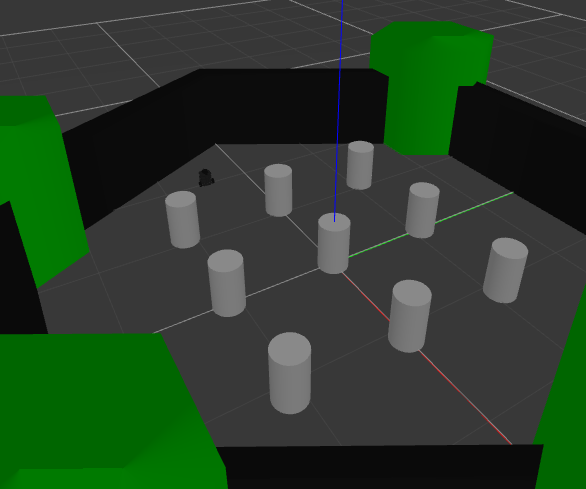
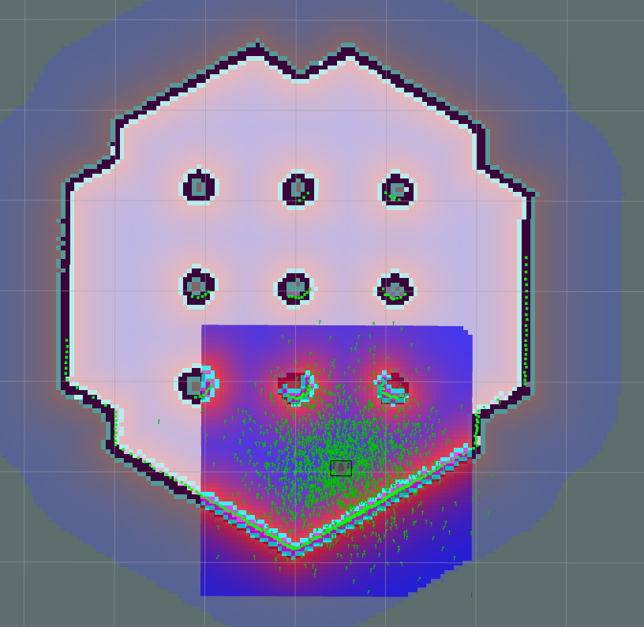
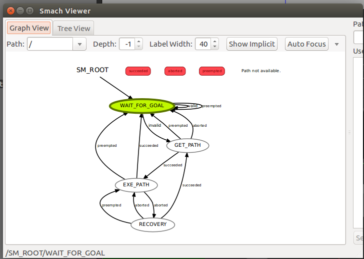

# MoveBase Flex

## 1. Overview

Move Base Flex (MBF) is a backwards-compatible replacement for move_base. MBF can use existing plugins for move_base, and provides an enhanced version of the planner, controller and recovery plugin ROS interfaces. It exposes action servers for planning, controlling and recovering, providing detailed information of the current state and the plugin’s feedback. An external executive logic can use MBF and its actions to perform smart and flexible navigation strategies. Furthermore, MBF enables the use of other map representations, e.g. meshes or grid_map.

In this project, we will focus on implementing a MBF to a Turtlebot3 robot. The model used here is Burger. The states of the MBF is visualized using a RQT plugin called SMACH viewer.

[SMACH viewer](http://wiki.ros.org/smach_viewer)

Go through the documentation and tutorilas to download and execute it.

## 2. How to execute

### 2.1. Getting started

Clone the repo and compile it,

```
git clone https://github.com/MayooranT/MoveBase-Flex.git
catkin_make
```

### 2.2. Spawn Turtlebot

Source the ROS system files and set the model. Then you will be able to launch it.

```
source /opt/ros/kinetic/setup.bash
export TURTLEBOT3_MODEL=burger
roslaunch turtlebot3_gazebo turtlebot3_world.launch 
```
This will launch the Turtlebot3 in a Gazebo window.



### 2.3. Run MBF

Run the following commands in a seperate terminal in the same workspace. The following will be launched internally by the launch file. 
<ul>
<li> RViz </li>
<li> MoveBase Flex </li>
<li> SMACH viewer </li>
</ul>

```
source devel/setup.bash
export TURTLEBOT3_MODEL=burger
roslaunch mbf_beginner main.launch 
```





## 3. State change

1. Select 2D nav Goal in RViz

2. Place it in a coordinate in RViz

3. Once you placed it, you can visualize the SMACH viewer displays the state changes.

